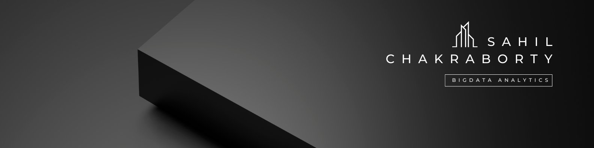
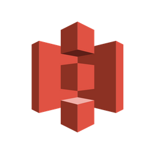

  

<!--Night Owl image-->

  

#  ɪ'ᴍ SAHIL! 
  

Hi, I’m a student focused on Data Engineering and Analytics, building real-world, production-style data solutions. I work extensively with PySpark, Spark Structured Streaming, Delta Lake, and modern data tools to design scalable pipelines and analytical systems. 

- 🎓 B.Tech in Information Technology (Graduating 2027)  
- 📊 Focused on **Big Data Analytics & Engineering**  
- 🏗️ Built scalable **PySpark + Delta Lake** pipelines  
- 📈 300+ LeetCode problems solved  
- 📚 Strong in DBMS, OS, CN & System Design  
- 📱 Also experienced in Flutter-based full-stack apps  

<table width="100%">
<tr>

<td width="60%" align="center" valign="top">

### 🛠 Tech Stack  

<table>
<tr>
<td width="50%" align="center">

### 👨‍💻 Programming  

  

</td>

<td width="50%" align="center">

### 📊 Data Analytics  

  
  
  
  
  
  

</td>
</tr>

<tr>
<td width="50%" align="center">

### ⚙️ Big Data & Cloud  

  
  
  
  

</td>

<td width="50%" align="center">

### 📱 Development & Tools  

  

</td>
</tr>
</table>

</td>

<td width="40%" align="center" valign="top">

### 📈 GitHub Analytics

  

  

</td>

</tr>
</table>

## 🚀 Big Data Analytics  

<table>
<tr>
<td width="50%" align="center">

### [E-Commerce Medallion Data Pipeline](https://github.com/Sahil-Chakraborty/Ecommerce-medallion-data-pipeline-databricks)  
⚙️ An end-to-end Lakehouse-based E-Commerce analytics solution built using a Medallion Architecture (Bronze → Silver → Gold) in Databricks.
The project processes raw transactional CSV data into a curated gold-layer fact model powering interactive Tableau dashboards.

</td>
<td width="50%" align="center">

### [Spark Lakehouse CDC Pipeline](https://github.com/Sahil-Chakraborty/Spark-lakehouse-cdc-pipeline)  
🔥 This project implements a production-style Lakehouse data engineering pipeline using Apache Spark Structured Streaming and Delta Lake on Databricks.The objective of this project is to simulate real-world modern data engineering workflows including incremental ingestion, schema evolution handling, streaming transformations, and dimensional modeling for BI consumption.
 
</td>
</tr>
</table>

## 📊 Data Analysis Projects  

<table>
<tr>
<td width="50%" align="center">

### [Sales Report Analysis](https://github.com/Sahil-Chakraborty/Amazon-Sales-Analysis-Internship-Project-)  
🛍️ Comprehensive EDA on sales transactions covering order trends, product performance, fulfillment efficiency, customer segmentation, geographic distribution, and actionable business insights to optimize revenue and retention.

</td>
<td width="50%" align="center">

### [Attrition Analysis Dashboard](https://github.com/Sahil-Chakraborty/Attrition-Analysis)  
📊 Comprehensive analysis of employee attrition using Python (EDA, visualization) and Tableau. Identified key demographic, job-related, and compensation factors driving turnover, providing actionable insights for HR to improve retention, engagement, and workforce planning.

</td>
</tr>

<tr>
<td width="50%" align="center">

### [Global AI Adoption Accross Leading Industries](https://github.com/Sahil-Chakraborty/AI-Impact-on-Global-Industries)  
🤖 Analyzes global AI adoption (2020–2025) across industries and regions, covering trends in usage, market shifts, revenue, jobs, collaboration, and public trust. Shows how AI transforms key sectors and reshapes market shares of USA, UK, China, and India, highlighting both opportunities and challenges.

</td>
<td width="50%" align="center">

### [Amazon Customer Survey Analysis](https://github.com/Sahil-Chakraborty/Amazon-customer-survey-Analysis)  
🛒 Analysis of Amazon customer survey data to uncover key demographics, satisfaction drivers, pain points, and improvement opportunities.

</td>
</tr>

<tr>
<td width="50%" align="center">

### [Finance Analysis](https://github.com/Sahil-Chakraborty/Company-Finance-Analysis/tree/main)  
📉 Financial analysis of a company's performance by geography, segments, sales, profits, discounts, and key business metrics to reveal insights.

</td>
<td width="50%" align="center">

### [Bank Customer Churn Analysis](https://github.com/Sahil-Chakraborty/Bank-Churn-Analysis)  
🔍 Behavioral churn analysis based on customer demographics, activity, and account metrics.  

</td>
</tr>

<tr>
<td width="50%" align="center">
  
### [Data Science Salaries EDA](https://github.com/Sahil-Chakraborty/Data_Science_Salaries_EDA_2023)  
💼 EDA on global data science salaries across roles, levels, and locations.  

</td>
<td width="50%" align="center">
  
### [Product Sales Analysis](https://github.com/Sahil-Chakraborty/Amazon_Sales_Analysis)  
📈 Sales trend analysis with insights on pricing, discounts, and customer ratings.  

</td>
</tr>

<tr>
<td width="50%" align="center">
  
### [AI Usage by Students](https://github.com/Sahil-Chakraborty/Analysing_AI_Usage_by_Students)  
📊 Data analysis on AI adoption trends among students, tasks, and outcomes.  

</td>
<td width="50%" align="center">  
</td>
</tr>
</table>

## 📱 Flutter Projects  

<table>
<tr>
<td width="50%" align="center">
  
### [Prism News App](https://github.com/Sahil-Chakraborty/prism)  
📰 Real-time Flutter news app delivering categorized and trending articles.  

</td>
<td width="50%" align="center">
  
### [Focalix](https://github.com/Sahil-Chakraborty/Focalix)  
🖼️ AI-powered chatbot that answers questions based on user-uploaded images.  

</td>
</tr>

<tr>
<td width="50%" align="center">
  
### [Weather App](https://github.com/Sahil-Chakraborty/weather_app)  
🌦️ Flutter weather app fetching real-time weather with a clean UI.  

</td>
<td width="50%" align="center">
  
### [Verse](https://github.com/Sahil-Chakraborty/Verse)  
💬 A modern platform for verse and thought writers built in Flutter with smooth UI & real-time features.  

</td>
</tr>
</table>

### 📫 Let’s Connect!

  
  
  

  

